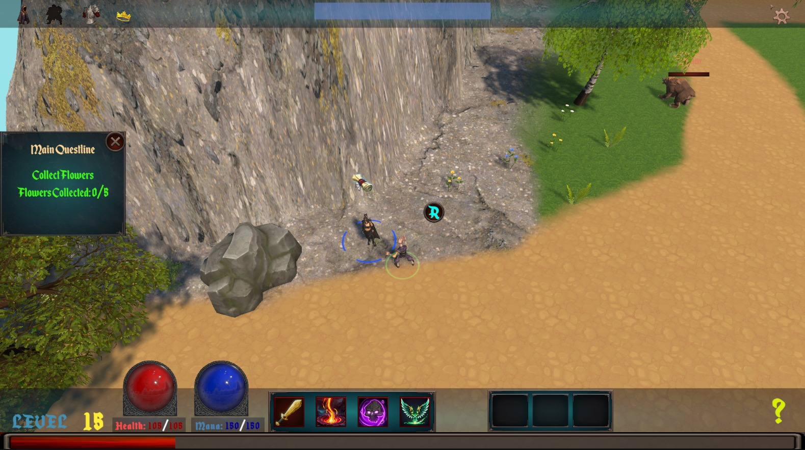
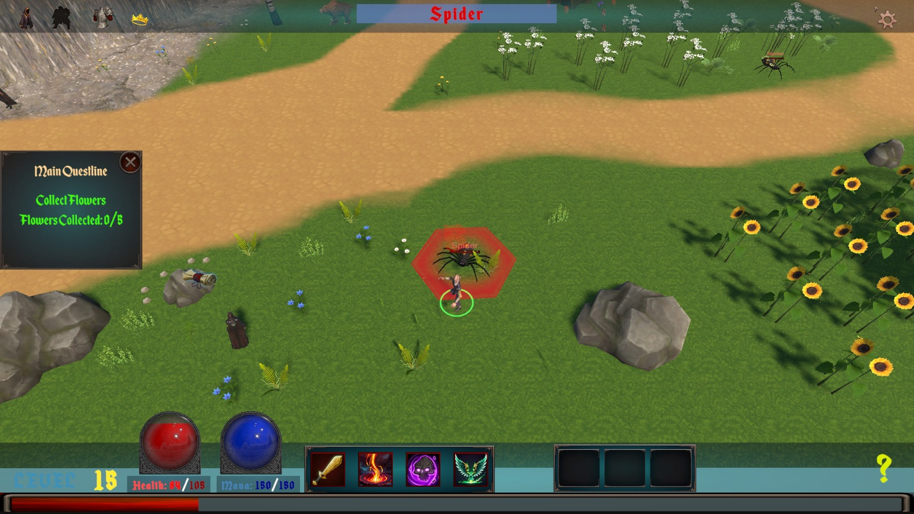
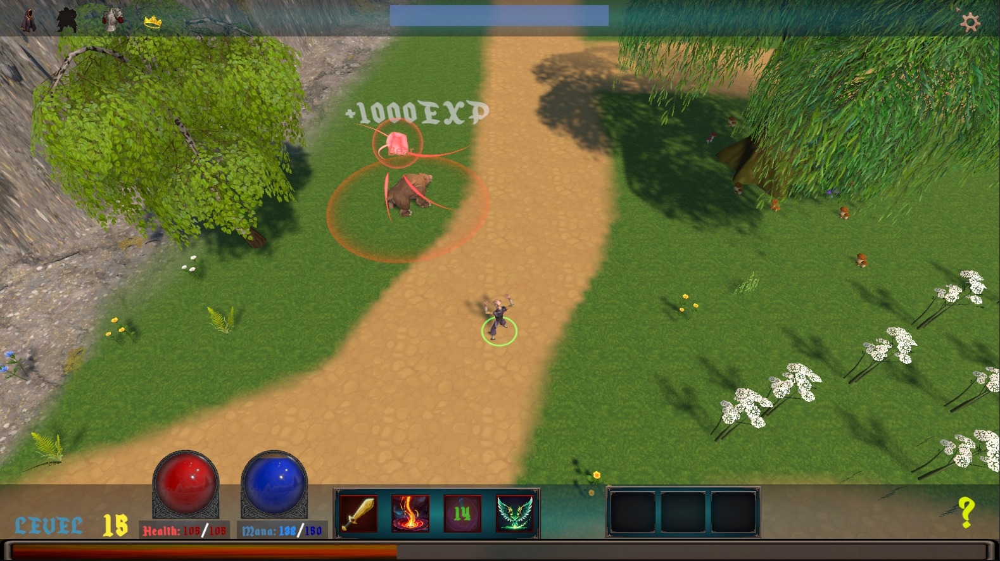

# Shuboria RPG
Shuboria is a fantasy-themed action RPG built with Unity. You play as a mystical mage exploring ancient lands, battling enemies with powerful abilities, and progressing by gaining experience and unlocking skills.

## Features

-RPG Gameplay experience
-Level up!:Kill monsters gain experience points(gain ability points) and items  
-Open World: Improve your character by discovering the shuboria world  
-Gain Stats: Gain Int,Dex,Str by ability points  
-Questing: Complete quests gain gold and items while leveling  

## Systems Implemented

-Classic UI for RPG game  
-Ability System(Stats and abilities)  
-Quest System  
-Inventory System  
-NPC and World Interaction System  
-Local Data Saving System  
-Artificial Intelligence(Enemy)  

⏳ Experience system with progressive leveling formula
## Technologies Used
Unity 6

## Screenshots

