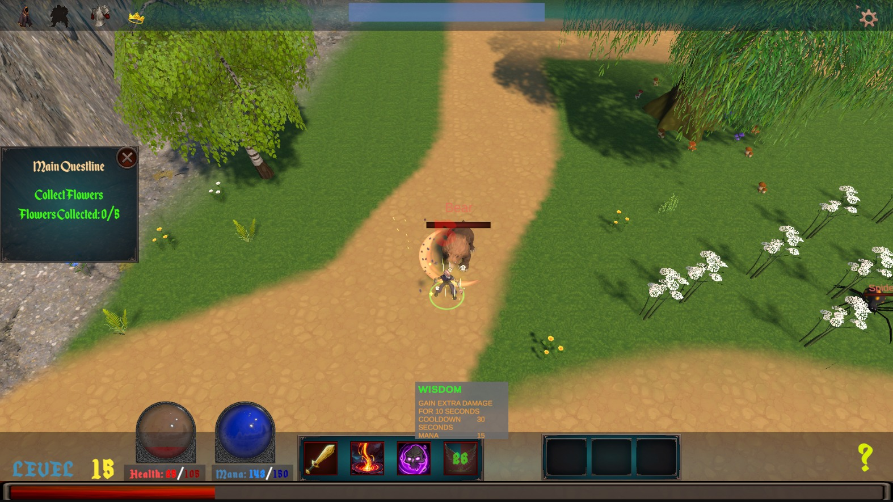

# Shuboria RPG
Shuboria is a fantasy-themed action RPG built with Unity. You play as a mystical mage exploring ancient lands, battling enemies with powerful abilities, and progressing by gaining experience and unlocking skills.

## Features
🎮 Smooth player movement with responsive controls

⚔️ Dynamic ability system with cooldowns and visual effects

💥 Projectile-based combat

📊 Floating combat text for damage and experience

🧠 Basic AI and enemy behavior

🌍 Save/load system with persistent player data

🎨 UI updates for health, mana, and cooldowns

⏳ Experience system with progressive leveling formula
## Technologies Used
Unity 6

## Screenshots

